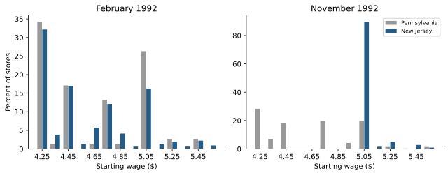
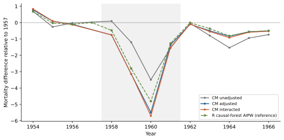
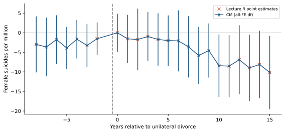
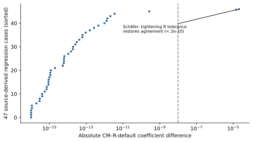
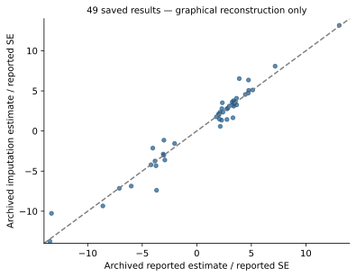
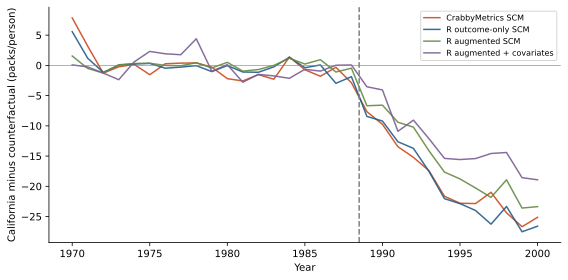

## Implementation follow-up

The original findings below describe the unmodified 0.9.0 audit. The subsequent
[implementation report](yqx-panel-fixes.qmd) documents the corrected SCM solver,
FE prediction/covariance controls, native FE imputation, and new R-backed tests.
Historical audit numbers are intentionally preserved.

## Findings

Yiqing Xu's six [panel-data lectures](https://github.com/xuyiqing/panel-lectures)
provide a useful empirical test of the distinction between **regression kernels**
and **complete causal-panel workflows**. CrabbyMetrics' regression kernels cover
much of the first category. Treatment-aware sample construction, counterfactual
prediction, heterogeneous-effect aggregation, and joint diagnostic inference
remain substantial gaps.

This is a **partial replication and an implementation specification**, not a
claim to have reproduced all empirical results in the decks. All six decks were
inventoried. Published illustrations without matching microdata, methods without
current APIs, and resource-limited cases remain explicitly identified.

The branch is `replication/yqx-panel-lectures-2026-09-21`, based on upstream
`0b56835` (v0.9.0). **No production estimator code was changed.**

| Result | Evidence |
|---|---|
| Core OLS/FE estimates agree with R | 59 specifications, 102 coefficients; maximum absolute difference $2.28\times10^{-12}$ |
| Broad reanalysis regression coverage | 47 of 49 archive datasets fitted through CM and R; 45 source point specifications and 2 explicitly simplified, no-unit-trend baselines |
| Standalone SCM has a numerical defect | Prop99 pre-RMSE 2.399913 versus same-objective optimum 1.656400; reports convergence at budgets 50, 500 and 5,000 |
| FE counterfactuals are composable but not first-class | Five CM explicit-dummy fits match R FEct closely, without a native treatment-aware imputation/inference API |
| Default inference conventions differ | Fatalities TWFE SE: CM 0.385787; fixest 0.357078; lecture plm HC1 0.350150 |
| Large and method-specific gaps remain | Two 89m/158m-observation data sets not loaded; full multi-method/bootstrap/sensitivity pipelines not reproduced |

The most valuable next changes are **SCM solver correctness**, followed by a
**panel observation/treatment-mask contract and efficient FE imputation**.
Adding another in-sample low-rank decomposition would not address the central
gap exposed by these lectures.

Downloads: [implementation specification](SPEC.md) · [family inventory](coverage.csv)
· [replication guide](README.md) · [code and numerical results](replication-bundle.zip).

## Sources, samples, and verification

The lectures are pinned to commit
`891412f174fc0283677de84d612622ff602dd1d3`. Ten initial public data inputs cover
Swiss naturalization, Card–Krueger stores, beer taxes and fatalities, unilateral
divorce, the Chinese famine, smoking, turnout, and coethnic donations.

The Chiu–Lan–Liu–Xu [reanalysis archive](https://doi.org/10.7910/DVN/9RJFZF),
version 1.0, supplies 49 study datasets and their scripts. Its 582 MB ZIP was
checksum-verified. The archive was initially inaccessible but a later ordinary
download succeeded; **the modern examples are not being labeled data-blocked
merely because of that transient failure**.

All raw inputs live in an ignored local cache. The branch records source URLs,
hashes, source-derived model specifications, package versions, output tables,
and reproducible scripts. R references are independent of the CM fitting
implementation. Equal designs are verified separately from equal source
specifications. In particular, the divorce event-study check uses the lecture's
original `i(rel_b, ref=-1)` formula, not merely the Python-generated dummies.

```{python}
from pathlib import Path
import os, json
import numpy as np
import pandas as pd
import crabbymetrics as cm

override = os.environ.get("YQX_REPLICATION_ROOT")
if override:
    root = Path(override)
else:
    root = next(p / "replications/yqx_panel" for p in [Path.cwd(), *Path.cwd().parents]
                if (p / "replications/yqx_panel/results").exists())
out = root / "results"
verification = json.loads((out / "verification.json").read_text())
linear = pd.read_csv(out / "linear-comparison.csv")
archive = pd.read_csv(out / "archive-comparison.csv")
assert verification["linear_specifications"] == 59
assert linear.coef_error.max() < 1e-8
assert verification["schafer_error_tight_R"] < 1e-8
print(f"{len(linear)} linear coefficients checked; "
      f"{archive.status.eq('completed').sum()}/49 archive regressions completed.")
print("This verifies recorded comparisons, not all causal estimators in the archive.")
```

### What the counts do not mean

- The 47 archive runs are **regressions**, not 47 full reproductions of FEct,
  Sun–Abraham, Callaway–Sant'Anna, stacked DID, PanelMatch, DID-multiple,
  HonestDiD, all diagnostic tests, or all confidence intervals.
- Two runs omit source-required unit-specific slopes and are labeled baseline
  comparisons. They are not exact Kogan/Magaloni source replications.
- The Hall–Yoder and Sanford metadata report about 89m and 158m observations.
  They were excluded before decompression on this 16-GiB workstation. Their
  failure boundary was **not measured**; an exact aggregation or larger-memory
  run is needed. Subsampling would change the replication claim.
- Simulated illustrations, causal diagrams, title-page crops and context-only
  maps are not counted as empirical estimates.

## Lectures 1–2: fixed effects and basic DID

### Swiss naturalization and fatalities

The 245-municipality, 19-year Swiss panel produces these treatment coefficients:

| Specification | CM estimate | Comparison |
|---|---:|---|
| Pooled | 2.503318 | R agreement |
| Municipality FE | 3.022800 | R agreement |
| Municipality + year FE | 1.203658 | R agreement |
| Municipality FE + common linear trend | 0.824793 | R agreement |
| Municipality + year FE + municipality slopes | 0.986524 | Explicit slope-column workaround |
| Plus municipality quadratic trends | 1.222728 | Explicit slope-column workaround |

The SVP linear interaction and four vote-share bins also match R coefficients,
as do supplementary distributed-lag and lead–lag specifications. The latter
follow commented source formulas; the old Stata demonstrations are conditional
frames rather than all active empirical targets.

Beer-tax coefficients are 0.364605 (pooled), -0.655874 (state FE), and -0.639980
(state/year FE). The lecture's Swamy–Arora random-effects result, -0.052016, is
regenerated **in R only**; CM has no corresponding random-effects estimator.

The principal regression gap is inference configuration, not coefficient
accuracy. CM currently uses an all-absorbed-FE residual-df correction. Default
fixest treats cluster-nested effects differently; the lecture's plm HC1 uses
another convention. Aligning the correction makes ordinary-design SEs agree.
The explicit varying-slope designs retain small rank-accounting differences
(about $4\times10^{-5}$ and $10^{-4}$ in SE), which should be exposed rather
than called unexplained numerical noise.

### Card–Krueger: sample bookkeeping matters

The available-outcome four-cell DID is **2.753606**; the complete-store
first-difference and store-FE estimates are **2.75**. Both are valid
reconstructions of their specifications, but they are not the same sample.
Unbalanced missing outcomes must not disappear behind a single “replicated” flag.



The longer Card–Krueger (2000) pretrend series is not reproduced: the source
explicitly says the underlying BLS ES-202 series is not public. The typed Mariel,
Gruber triple-difference and Hong tables are not freshly estimated here; their
microdata/specification pipelines were not among the retrieved inputs. The
WWI-tax and four shared reanalysis figures also lack matching inputs in this
checkout/archive. Re-entering those numbers would not count as replication.

## Lecture 3: factorial DID

The updated example has 921 counties: 412 without pre-PRC genealogies and 509
with them. The comparison is the mean mortality change over 1958–1961 relative
to 1957. All-population estimates are:

| Estimator | Estimate | SE / status |
|---|---:|---|
| Unadjusted DID | -1.540746 | 0.806678, CM/R agreement |
| Covariate-adjusted OLS1 | -2.688038 | 0.771132, CM/R agreement |
| Fully interacted OLS2 | -2.779546 | 0.812714 with composed variance correction |
| R IPW | -2.321293 | R reference only |
| R GRF AIPW | -2.370370 | R reference, seeded forest |
| CM ridge/logit AIPW | +0.264135 | Different nuisance pipeline; **not an exact replication** |

OLS2 illustrates why a generic robust SE is insufficient. The fdid implementation
uses `car::hccm(lm)`, whose actual default is HC3 (despite an HC0 source comment),
then adds $\gamma'\widehat\Sigma_X\gamma/n$. Composing that correction around
CM's HC3 covariance reproduces the R SE to machine precision. Ordinary HC1 gives
0.781958 and is not the same inference procedure.



The multivalued illustration was reconstructed in R using the specified
412/254/255 groups. Entropy balancing is also an R reference, but targets group
1 in the current fdid implementation, not the all-county population. Historical
`fig5`/table results use a different high-genealogy definition and are not
claimed as reproduced by the updated any-genealogy exercise. Geographic map
boundary data were not acquired.

The required package extension is a **contrast/target-population wrapper with
external nuisance-prediction support**, not an assertion that ridge/logit and
causal forests should return identical estimates.

## Lecture 4: TWFE event studies and decomposition

The divorce TWFE estimate is **-3.048894695**, matching the lecture's own -3.05
reproduction rather than the historical paper's -3.08. The CM event-study
coefficients agree with the original R formula within $8\times10^{-12}$.



A consequential detail: the -9 and +16 endpoint bins belong in the regression.
The plot omits them, but dropping the -9 regressor changes all coefficients.
The replication harness was corrected after the direct source-formula check
exposed that difference. Regression-engine parity alone would not have caught
a shared, incorrectly constructed design.

The R Bacon decomposition has weights summing to one and reconstructs the same
-3.048894695. It is an independent reference; CM does not yet supply the
decomposition or its design diagnostics.

## Lecture 5: modern DID and the 49-study archive

### Regression coverage and numerical accuracy



Among the 47 fitted archive cases, 46 agree with default R within
$2.72\times10^{-10}$. The remaining case is Schäfer's individual/year/age model:
default R yields -0.030371304, while CM yields -0.030391894. Tightening R's FE
tolerance from $10^{-6}$ to $10^{-10}$ gives -0.030391893, agreeing with CM within
$2\times10^{-10}$. Three permutations of CM's FE-column order agree to about
$10^{-12}$. This is evidence for recording convergence settings, **not** for
changing CM to reproduce the looser reference result.

Additional source effects were incorporated where specified: candidate-year,
state-chamber-year, province-year, district-census-group and age fixed effects.
The two source unit-trend specifications remain labeled baseline-only.

### Main applications

| Application | What was re-estimated | What remains |
|---|---|---|
| Bischof–Wagner | CM TWFE; explicit-dummy CM FEct 0.082334 versus R 0.082334 | Full six-estimator event curves and joint inference |
| Grumbach–Sahn donations | Source covariates, CM TWFE; composed CM/R FEct 0.127749 | PanelMatch and bootstrap diagnostics; 118 retained treated cells versus lecture text's 74 |
| Trounstine lawsuits | Native CM TWFE -0.050607; R FEct -0.057846 | Trend-augmented diagnostics, joint pretrend/placebo tests |
| Christensen–Garfias cadastre | Native full-sample TWFE 0.031675; R FEct full -0.119774, trimmed +0.044482 | Full set of heterogeneous-DID/event/inference comparisons |

The Brazil saved summary uses `chris_sub`, not the full-sample exercise. The
trim selects `anyswitch_period == 1` and years through 2014, changing support
and comparison cohorts. The sign change is exactly why an estimator result
should carry an explicit sample/exclusion record.

The archived aggregate table also contains unresolved naming/value discrepancies
for Eckhouse and Esberg relative to fresh fits of their correspondingly named
data and scripts. These are retained in the comparison CSV rather than
“corrected” by silently swapping labels. Consequently, matching R on an exported
design is distinguished from reproducing an archived result under its label.

### Saved-output reconstruction is not re-estimation



The saved imputation/reported-estimate ratio has mean **1.021957** and median
**1.006334**. The latter rounds to 1.01, not the lecture text's 1.00. This may
reflect source-version/rounding differences; the exact recorded numbers are
preserved. The saved p-value and sensitivity summaries are not presented as
newly computed bootstrap results.

Current CM APIs do not supply the full Sun–Abraham, group-time ATT, PanelMatch,
DID-multiple, carryover/equivalence or HonestDiD workflows. Some algebra can be
composed from current kernels, but that is different from having validated
sample rules, aggregation weights and joint covariance interfaces.

## Lecture 6: synthetic panels

### Confirmed SCM failure

The source-script outcome-only SCM is a constrained least-squares problem.
R augsynth and an independent SciPy SLSQP solve agree on its optimum. CM's
standalone solver does not:

| Implementation | Pre-RMSE | Mean post-treatment gap |
|---|---:|---:|
| CM standalone SCM | 2.399913 | -18.998496 |
| R augsynth, no augmentation | 1.656400 | -19.513629 |
| Independent SciPy simplex QP | 1.656400 | -19.513630 |

CM returns the same suboptimal answer at 50, 500 and 5,000 iterations and sets
`converged=True`. This is not a discrepancy attributable to covariates,
augmentation or a different target. A constrained solver with boundary-optimum
support and objective/KKT-based diagnostics is the first proposed fix.

```{python}
# A small executable reproduction using the unchanged public API.
d = pd.read_csv(root / ".cache/smoking.csv")
w = d.pivot(index="year", columns="state", values="cigsale").sort_index()
pre = w.index < 1989
x = w.drop(columns="California").to_numpy(dtype=float)
y = w.California.to_numpy(dtype=float)
model = cm.SyntheticControl(max_iterations=500)
model.fit(x[pre], y[pre])
s = model.summary()
print({"pre_rmse": s["pre_rmse"], "reported_converged": s["converged"],
       "post_gap": float((y-model.predict(x))[~pre].mean())})
```



The three lecture-script augsynth variants yield -19.513629, -15.952567 and
-12.710049. Their paths and pointwise bounds are saved. The separate canonical
ADH predictor recipe and 39 in-space placebo fits are reconstructed in R; the
lecture does not distribute its original `ca1`–`ca8` script, so these are not
claimed as exact figure-provenance matches or as a native CM predictor-V API.

### SDID and imputation

CM synthetic DID gives **-15.605398**, versus **-15.603828** from R synthdid.
That is close, not exact optimizer parity. The independently resampled
100-draw placebo SEs are 10.2815 and 10.6955. Equal integer seeds across R and
Rust do not create identical draws. The SDID scalar ATT is a double-weighted
contrast and must not be conflated with the mean of an arbitrary displayed
counterfactual-gap path.

On the turnout data, CM's ordinary TWFE treatment coefficient is 0.777574.
Explicit-dummy CM FE imputation matches R at **1.425566**. R's fixed-rank-2 IFEct
estimate is **5.005401**; this is a reference configuration, not a claim to have
replicated Xu's full rank-selection/CV/inference workflow.

Actual-data API probes establish the current boundary:

- Incomplete coethnic panels: MC/SDID reject nonfinite outcomes.
- Complete-case panels that retain treatment reversals: MC/SDID reject
  nonabsorbing treatment.
- `InteractiveFixedEffects.fit(Y, W)` is not a supported signature; fitting
  all observed outcomes with `fit(Y)` would leak treatment effects into the
  nuisance surface and would **not** be IFEct.

Benin remote-sensing outcomes and the TROP experiments are not reproduced.
The TROP lecture script merely transcribes a published RMSE table; redrawing
that heatmap would not rerun its 21 experimental designs.

## Development priorities

The [full specification](SPEC.md) defines APIs, statistical contracts,
acceptance cases, and an implementation sequence.

1. **Fix standalone SCM numerical correctness and truthful convergence.**
2. **Introduce separate observation/treatment masks and FE counterfactual
   fitting**, with IDs, support checks, level prediction and explicit aggregation.
3. **Expose FE tolerance, rank/SSC choices, varying slopes and event-study
   conventions.** Preserve endpoint bins and record sample exclusions.
4. **Add heterogeneous-effect DID and joint diagnostic inference.** Cohort
   targets, control groups, pretrend/placebo/carryover tests, and sensitivity
   analysis cannot be inferred from a coefficient vector alone.
5. **Build treatment-aware IFE/MC and augmented-SCM workflows**, with tuning
   restricted to untreated training data.
6. **Add factorial-DID orchestration and external nuisance predictions**;
   consider random effects and other curricular gaps separately.

The immediate engineering opportunity is to turn well-performing regression
kernels into transparent, treatment-aware workflows, while repairing the
specific constrained-optimization failure exposed by Proposition 99.

## Complete empirical-family inventory

```{python}
from IPython.display import Markdown, display
coverage = pd.read_csv(root / "coverage.csv")
lines = ["| Deck | Empirical family | Status / boundary |", "|---|---|---|"]
for row in coverage.itertuples(index=False):
    clean = lambda s: str(s).replace("|", "/")
    lines.append(f"| {clean(row.deck)} | {clean(row.family)} | {clean(row.status)}. {clean(row.scope)} |")
display(Markdown("\n".join(lines)))
```

## Reproducibility and limitations

The download bundle contains original audit code, numerical summaries,
specifications and manifests, but no third-party microdata. Follow its README
to fetch the verified inputs and install the
recorded R reference versions locally. `summarize.py` verifies coefficient
comparisons and rebuilds plots; it does not silently replace missing native
estimators with R outputs.

Source scripts are the primary specification where supplied. Where only images
or saved estimates exist, exact version/sample/inference parity remains a
separate unresolved requirement. The archive's very large datasets, full
resampling pipelines, two source unit-trend regressions, several missing-data
examples, and unprovided empirical inputs are explicitly left open. Completing
all lecture results requires both those inputs/resources and the API work in
the specification—not merely a larger “tests passed” count.
