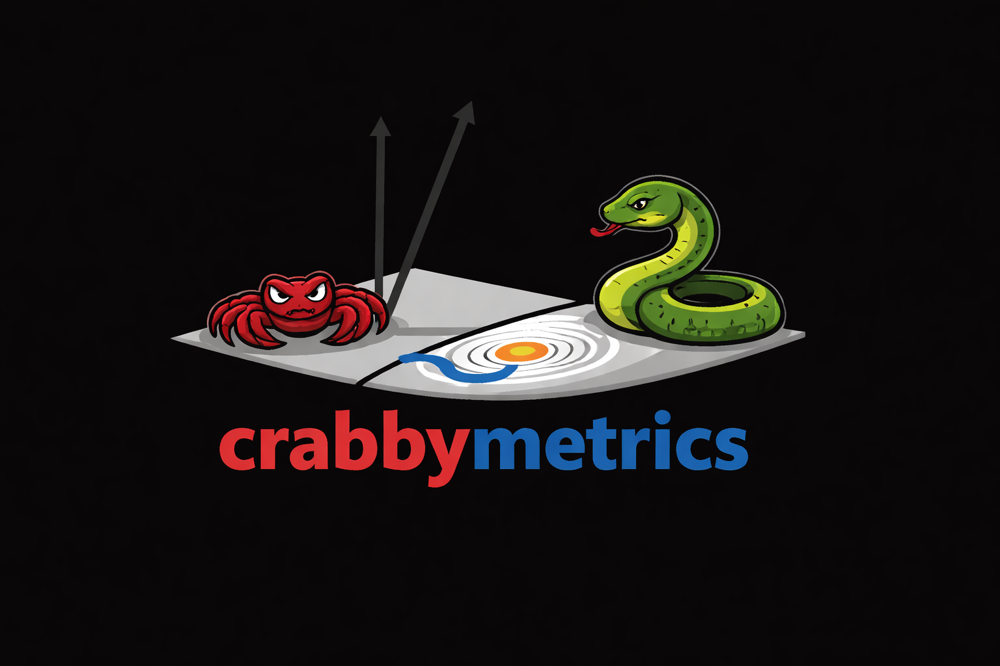

{fig-alt="crabbymetrics logo" width="70%"}

`crabbymetrics` is a Rust-backed econometrics library with a compact Python API. The docs are organized around the public API, a single binding crash course, an active `First Course Ding` translation track, regression/GLM examples, causal-inference examples, transform notes, focused numerical ablations, and a small set of supporting internals pages.

## Start Here

- [API reference](api.html): verified public surface, summary schemas, optimizer catalog, and runtime smoke checks.
- [llms.txt](llms.txt): dense LLM-facing package guide with install notes, data-shape contracts, estimator selection guidance, signatures, examples, source-map pointers, and links.
- [First Course Ding](first-course-ding.html): chapter-by-chapter translation plan and current implementation status for the Peng Ding notebooks.
- [Binding Crash Course: OLS](mechanics-ols.html): the shortest end-to-end walkthrough of the Rust-to-Python wrapper pattern in this codebase.

## First Course Ding

- [Overview And TOC](first-course-ding.html): planning page and chapter map for the full Ding translation pass.
- Translated so far:
  [Chapter 1](ding/ch01-correlation-simpson.html),
  [Chapter 2](ding/ch02-potential-outcomes.html),
  [Chapter 3](ding/ch03-cre-frt.html),
  [Chapter 4](ding/ch04-cre-neyman.html),
  [Chapter 9](ablations/bridging-finite-and-superpopulation.html),
  [Chapter 11](ding/ch11-propensity-score.html),
  [Chapter 12](ding/ch12-double-robust-ate.html),
  [Chapter 13](ding/ch13-double-robust-att.html),
  [Chapter 21](ding/ch21-iv-experiments.html),
  and [Chapter 23](ding/ch23-iv-econometrics.html).
- The next obvious tranche is Chapters 15 through 20, where matching, sensitivity analysis, and RD helpers start to matter.

## Regression And GLM Examples

- [OLS](examples/ols.html): baseline linear regression with switchable vanilla and HC1 covariance estimators.
- [Ridge](examples/ridge.html): closed-form L2-regularized least squares with a scalar penalty or a penalty grid plus cross-validation.
- [Fixed Effects OLS](examples/fixed-effects-ols.html): partial out one-way or multi-way categorical fixed effects with `within`, then estimate slopes without an intercept.
- [ElasticNet](examples/elastic-net.html): regularized linear regression.
- [Logit](examples/logit.html): binary logistic regression.
- [Multinomial Logit](examples/multinomial-logit.html): multiclass classification.
- [Poisson](examples/poisson.html): count regression, with model-based or QMLE sandwich inference available from `summary(vcov=...)`.
- [GMM](examples/gmm.html): fit just-identified score equations, overidentified two-step IV moments, and stacked nuisance-parameter moments with the first-class `GMM` estimator.
- [MEstimator Poisson](examples/mestimator-poisson.html): callback-driven estimation matched against the built-in Poisson estimator.

## Causal Inference Examples

- [Balancing Weights](examples/balancing-weights.html): entropy and quadratic calibration weights for ATT-style reweighting, covariate shift, and domain adaptation.
- [Cressie-Read And Rényi Balancing](examples/cressie-read-balancing.html): power-divergence balancing weights, Rényi alpha-grid diagnostics, and ATT reweighting under good, medium, and bad overlap.
- [EPLM](examples/eplm.html): the Robins-Newey partially linear E-estimator, implemented as a stacked-moment estimator for a scalar continuous treatment.
- [Average Derivative](examples/average-derivative.html): Oaxaca-Blinder, generalized IPW, and doubly robust average-derivative estimators in the Graham-Pinto style under a continuous-treatment working model.
- [Double ML And AIPW](examples/double-ml.html): cross-fit ridge nuisance estimation for partially linear DML and binary-treatment AIPW.
- [Richer Regression With Transformer Pipelines](examples/richer-regression.html): a longer semiparametric-style example built on `KernelBasis` and `PCA`.
- [TwoSLS](examples/twosls.html): instrumental variables regression, including multiple endogenous regressors and multiple excluded instruments.
- [Synthetic Control](examples/synthetic-control.html): simplex-constrained donor weighting for treated-versus-donor panel matching under latent-factor drift.
- [Synthetic DID](examples/synthetic-did.html): matrix-panel synthetic difference-in-differences with `fit(Y, W)`.
- [Augmented Balancing for Panel Data](examples/augmented-balancing.html): combine an externally estimated untreated-outcome surface with unit and time residual balancing in staggered-adoption panels.
- [Horizontal Panel Ridge](examples/horizontal-panel-ridge.html): horizontal-regression counterfactual forecasts for staggered treatment panels.
- [Matrix Completion](examples/matrix-completion.html): low-rank completion of treated panel cells under the shared panel matrix contract.
- [Interactive Fixed Effects](examples/interactive-fixed-effects.html): factor-model decomposition for balanced panels.
- [Staggered Panel Event Study](examples/staggered-panel-event-study.html): Hainmueller--Hangartner staggered-adoption panel walkthrough comparing crabbymetrics matrix estimators with pyfixest TWFE and saturated event studies.

## Transform Examples

- [PCA And Kernel Basis](examples/pca-and-kernel-basis.html): transformer examples for richer design matrices and nonlinear geometry.

## Ablations

- [Variance Estimators](ablations/variance-estimators.html): cached Monte Carlo coverage experiments for OLS, Poisson, and GMM variance estimators under heteroskedasticity or overdispersion.
- [Semiparametric Estimator Comparisons](ablations/semiparametric-estimators.html): cached Monte Carlo comparisons for EPLM versus partially linear DML under continuous-treatment misspecification, and for vanilla regression versus balancing weights versus AIPW under binary treatment.
- [Two-Period Semiparametric DID](ablations/two-period-did-semiparametric.html): cached Monte Carlo comparisons for unadjusted, outcome-model, IPW, and AIPW two-period DID under unconditional and conditional parallel trends regimes.
- [Bridging Finite And Superpopulation](ablations/bridging-finite-and-superpopulation.html): cached Monte Carlo coverage comparisons for HC2, Ding's closed-form correction, a raw-row bootstrap, and stacked GMM when the same adjusted estimator is evaluated against SATE and PATE.
- [Panel Estimator DGP Comparisons](ablations/panel-dgp-comparisons.html): cached Monte Carlo ATT comparisons for TWFE, synthetic control, synthetic DID, and matrix completion across additive, factor, and selected-adoption panel DGPs.
- [Randomized Sketching And Least Squares](ablations/randomized-sketching-ols.html): math notes and cached ablations for randomized QR/SVD sketches, CountSketch OLS, and sketched IV/2SLS on tall designs.
- [Same Root Panel Case Studies](ablations/same-root-panel-cases.html): cached Basque Country and California Proposition 99 case-study comparisons that put simulation, horizontal/vertical estimators, synthetic DID, matrix completion, and donor-placebo inference in one workflow.

## Optimization

- [Optimizers](examples/optimizers.html): direct optimizer usage for smooth likelihoods, rougher objective surfaces, and solver behavior comparisons.
- [GMM With Optimizers](examples/gmm-with-optimizers.html): the lower-level notebook that motivated the first-class `GMM` estimator and still shows the residual-collection view directly.

## Supporting Pages

- [Binding Internals: Poisson](mechanics-poisson.html): a deeper built-in-estimator walkthrough after the OLS crash course.
- [Binding Internals: MEstimator](mechanics-mestimator.html): the callback-heavy bridge where Rust owns optimization and Python supplies the objective and scores.

## Runtime Snapshot

{fig-alt="Runtime comparison benchmark across crabbymetrics, scikit-learn, and statsmodels" width="100%"}

The benchmark figure is generated from the repo-level benchmark assets in `benchmarks/` and gives a quick scale check for the estimators that overlap cleanly with mainstream Python baselines.

## Notes

- `api.qmd` remains the main documentation page and renders to `api.html`.
- The site is a Quarto website, so shared navigation and search are generated under `docs/`.
- All pages are rendered with embedded resources so the checked-in HTML files remain self-contained.
